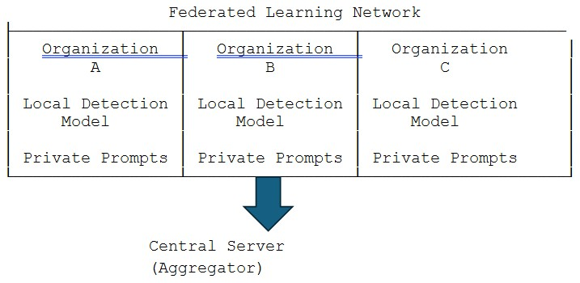

# Federated Prompt Injection Detection in LLMs

> ⚠️ This project is currently under active research and development. All implementations, models, and evaluations will be added progressively.

---

## 🧠 Overview

This research investigates a **novel approach to detecting prompt injection attacks in Large Language Models (LLMs)** through the use of **federated learning**, allowing multiple organizations to collaborate on securing LLMs without compromising data privacy.

The project aims to address a critical security vulnerability — **prompt injection** — while preserving organizational confidentiality through decentralized machine learning.

---

## 🧪 Research Objectives

- 📌 Enable organizations to detect prompt injection **without sharing private prompts**.
- 🛡️ Combine **federated learning** with novel **adversarial prompt detection techniques**.
- 🧠 Implement **privacy-preserving methods** such as differential privacy and secure aggregation.
- 📊 Evaluate robustness, detection accuracy, and privacy utility tradeoffs.

---

## 👨‍🔬 Researchers

- [**Pappu Jha**](https://jhapappu.com.np) – Researcher  
- [**Hanzla Hamid**](https://www.linkedin.com/in/hanzla-hamid-b60551328/) – Researcher  
- [**Ashim Dahal**](https://ashimdahal.com.np/) – Research Mentor
- [**Dr. Nick Rahimi**](https://sites.google.com/view/nickrahimi/home) – Research Supervisor  

---

## 🔭 Planned Architecture

---

## 🚀 Planned Phases

### Phase 1: **Baseline Detection (Centralized)**
- Implement semantic analysis, rule-based filters, transformer classifiers
- Evaluate detection accuracy, F1-score, false positives, robustness

### Phase 2: **Federated Learning Simulation**
- Convert centralized models to federated setting (FedAvg)
- Simulate 3–5 organizational nodes
- Optimize communication and fault tolerance

### Phase 3: **Privacy Preservation**
- Add differential privacy to updates
- Implement secure aggregation protocols
- Evaluate resistance to model inversion and membership inference attacks

### Phase 4: **Advanced Detection Techniques**
- Multi-step reasoning validation
- Attention pattern analysis
- Long-context manipulation detection
- Evaluate robustness to adaptive attacks

---

## 📚 Dataset Strategy

Data will include:

- 🔒 Direct & indirect prompt injection attacks
- 🌍 Multi-language and encoding-based bypasses
- ✅ Benign prompts for baseline evaluation

**Sources**:
- Synthetic generation
- Public jailbreak datasets
- Simulated org-specific queries

---

## 📊 Planned Evaluation Metrics

- Detection: Accuracy, Precision, Recall, F1-Score, False Positives
- Federated Learning: Convergence, scalability, dropout resilience
- Privacy: Privacy budget consumption, utility degradation
- Real-world: Edge efficiency, communication overhead

---

## 🏁 Expected Deliverables

| Deliverable                         | Description                                  |
|-------------------------------------|----------------------------------------------|
| `baseline_models/`                  | Centralized prompt injection classifiers     |
| `fed_learning_sim/`                 | Simulated federated learning experiments     |
| `privacy_modules/`                  | DP and secure aggregation implementations    |
| `evaluation_results/`               | Experiment logs, accuracy reports, visuals   |
| `data/`                             | Curated prompt injection datasets            |

---

## 📌 License & Use

This research is academic in nature and aimed at improving LLM security in open and privacy-preserving environments. Usage and citations will follow the release of an official publication.

---